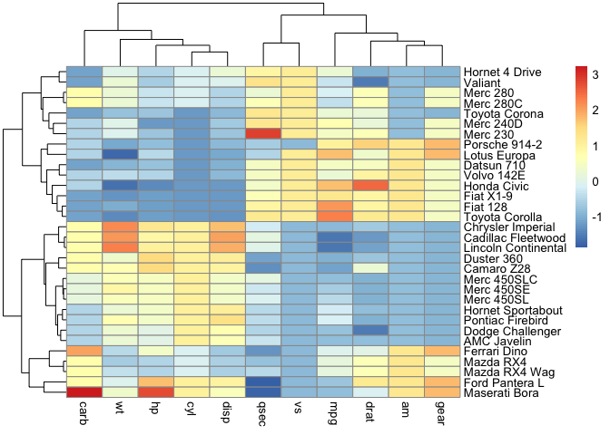
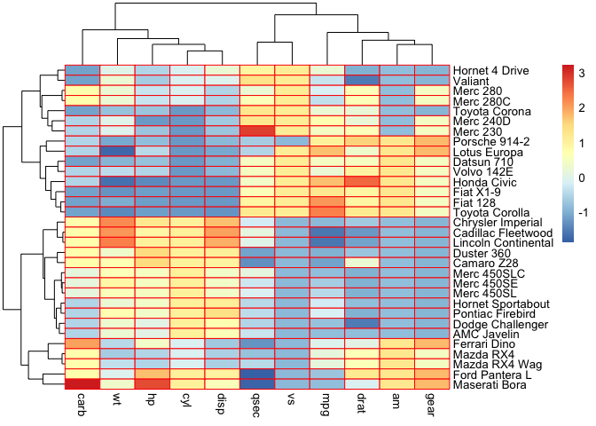
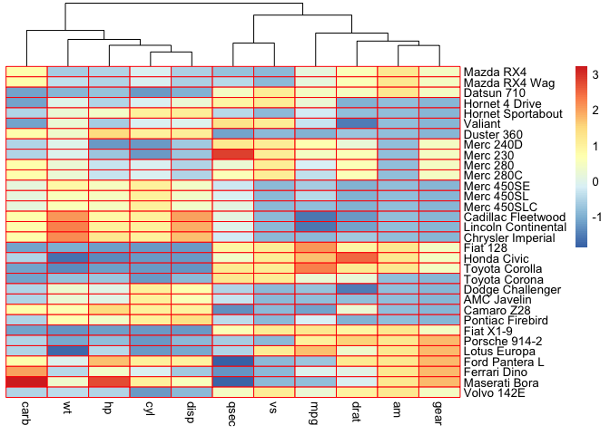
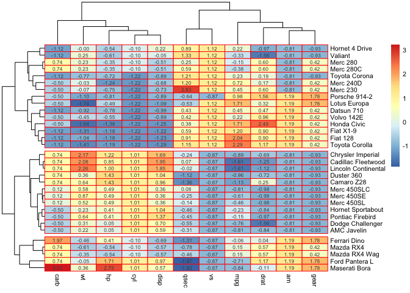
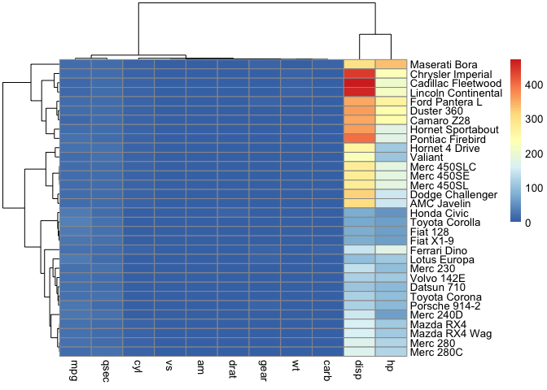
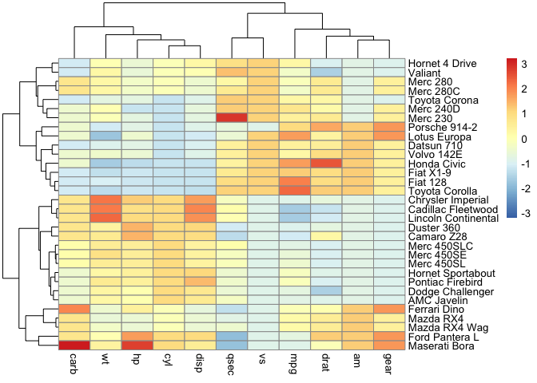

```r
#install pheatmap
#install.packages("pheatmap")
library(pheatmap)

#make a dataframe/matrix
head(mtcars)
```

```
##                    mpg cyl disp  hp drat    wt  qsec vs am gear carb
## Mazda RX4         21.0   6  160 110 3.90 2.620 16.46  0  1    4    4
## Mazda RX4 Wag     21.0   6  160 110 3.90 2.875 17.02  0  1    4    4
## Datsun 710        22.8   4  108  93 3.85 2.320 18.61  1  1    4    1
## Hornet 4 Drive    21.4   6  258 110 3.08 3.215 19.44  1  0    3    1
## Hornet Sportabout 18.7   8  360 175 3.15 3.440 17.02  0  0    3    2
## Valiant           18.1   6  225 105 2.76 3.460 20.22  1  0    3    1
```

```r
class(mtcars)
```

```
## [1] "data.frame"
```

```r
df = scale(mtcars)

#make heatmap
pheatmap(df)
```

<!-- -->

```r
#change arguments

pheatmap(df, 
         border_color = "red")
```

<!-- -->

```r
#
pheatmap(df, 
         border_color = "red",
         cluster_rows = F)
```

<!-- -->

```r
#
pheatmap(df, 
         border_color = "red",
         cluster_rows = T,
         cutree_rows = 3,
         show_rownames = T,
         fontsize = 8,
         display_numbers = T)
```

<!-- -->

```r
#without scaling
pheatmap(mtcars)
```

<!-- -->

```r
#with
pheatmap(mtcars, scale = "column")
```

<!-- -->

```r
#end
```

