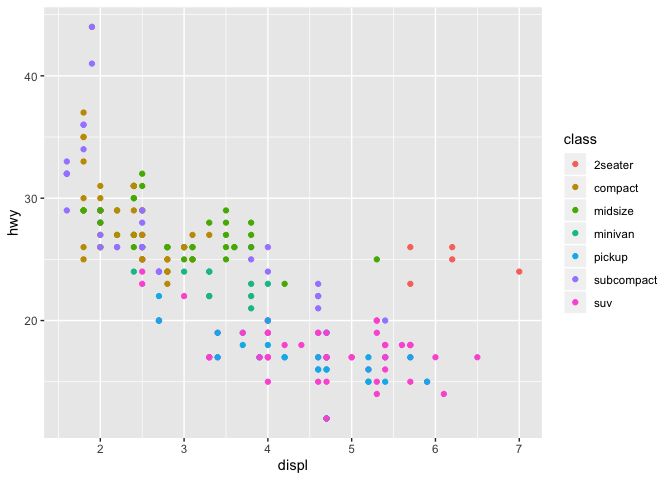
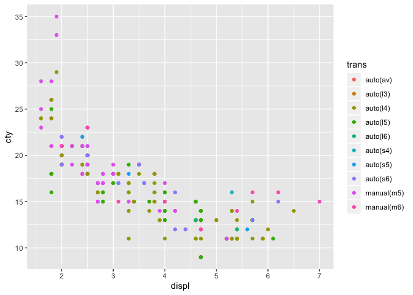
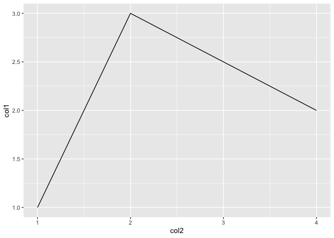
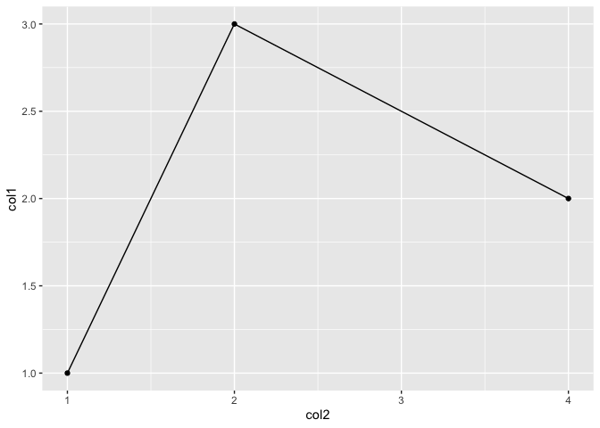
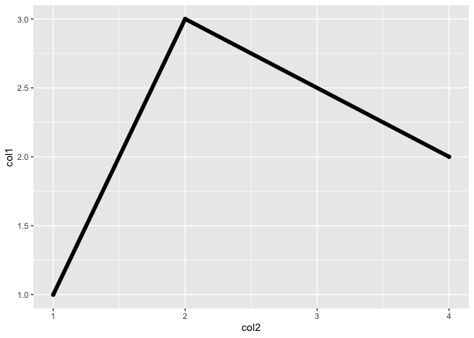
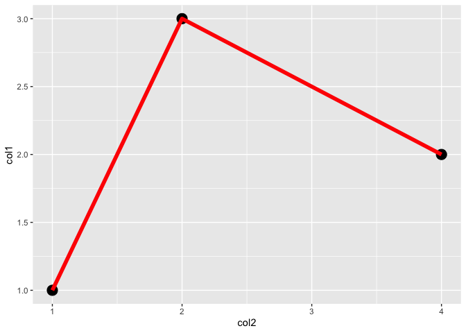
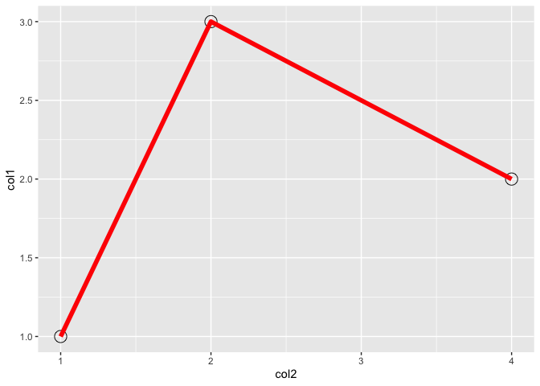
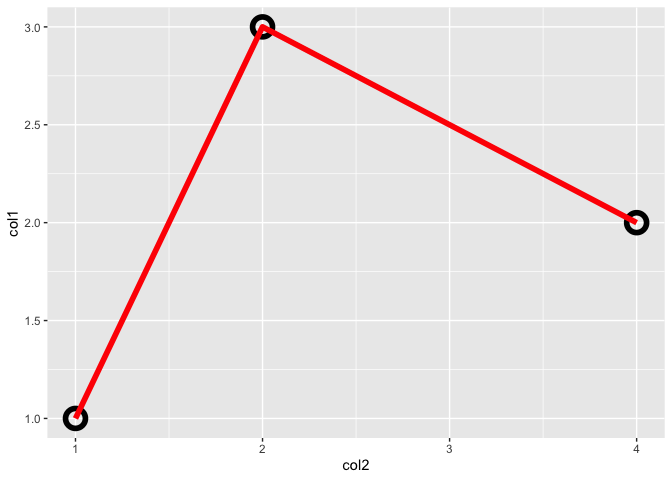

#install `ggplot2`


```r
#install.packages("ggplot2")
library(ggplot2)
```

#reproduce example of previous class for point plot


```r
#
head(mpg)
```

```
## # A tibble: 6 x 11
##   manufacturer model displ  year   cyl trans  drv     cty   hwy fl    class
##   <chr>        <chr> <dbl> <int> <int> <chr>  <chr> <int> <int> <chr> <chr>
## 1 audi         a4      1.8  1999     4 auto(… f        18    29 p     comp…
## 2 audi         a4      1.8  1999     4 manua… f        21    29 p     comp…
## 3 audi         a4      2    2008     4 manua… f        20    31 p     comp…
## 4 audi         a4      2    2008     4 auto(… f        21    30 p     comp…
## 5 audi         a4      2.8  1999     6 auto(… f        16    26 p     comp…
## 6 audi         a4      2.8  1999     6 manua… f        18    26 p     comp…
```

```r
ggplot(mpg, aes(displ, hwy)) +
    geom_point()
```

<!-- -->

```r
#add color
ggplot(mpg, aes(displ, hwy, color = class)) +
    geom_point()
```

<!-- -->

```r
#change variables
ggplot(mpg, aes(displ, cty, color = trans)) +
    geom_point()
```

<!-- -->

```r
#
```

#make line plot and know layered graphics


```r
#create data frame
df = data.frame(col1 = 1:3, col2 = c(1,4,2))

#line plot 
ggplot(df, aes(col2, col1)) +
    geom_line()
```

<!-- -->

```r
#layer points
ggplot(df, aes(col2, col1)) +
    geom_line() +
    geom_point()
```

<!-- -->

```r
#add parameters
ggplot(df, aes(col2, col1)) +
    geom_point() +
    geom_line(size = 2)
```

<!-- -->

```r
#
ggplot(df, aes(col2, col1)) +
    geom_point() +
    geom_line(size = 2, color = "red")
```

<!-- -->

```r
#
ggplot(df, aes(col2, col1)) +
    geom_point(size = 5) +
    geom_line(size = 2, color = "red")
```

<!-- -->

```r
#
ggplot(df, aes(col2, col1)) +
    geom_point(size = 5, shape = 21) +
    geom_line(size = 2, color = "red")
```

<!-- -->

```r
#
ggplot(df, aes(col2, col1)) +
    geom_point(size = 5, shape = 21, stroke = 3) +
    geom_line(size = 2, color = "red")
```

<!-- -->

