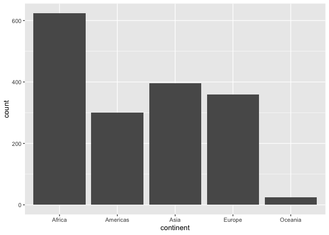
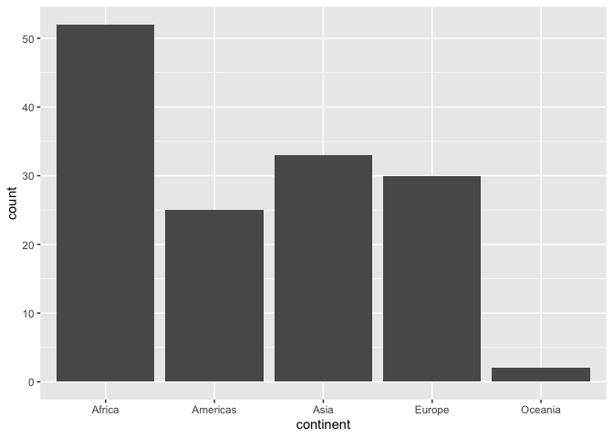
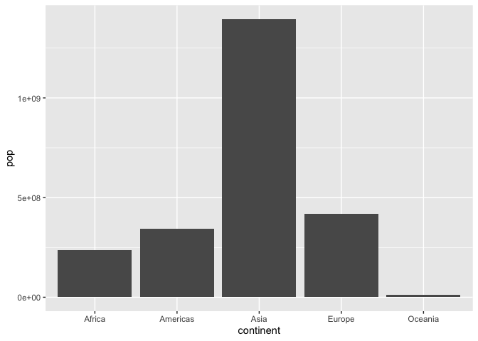
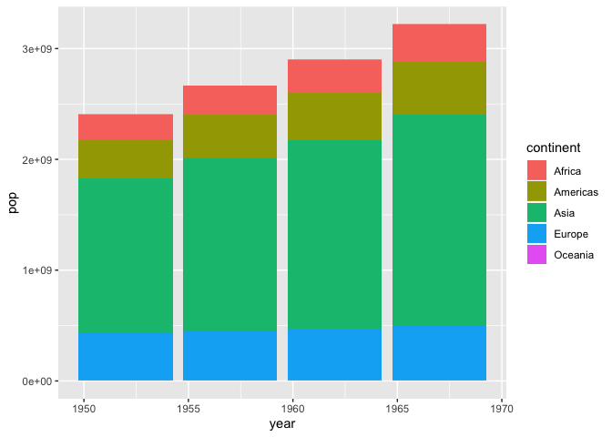

## install `tidyverse`


```r
#install.packages("tidyverse")
library(tidyverse)
```

```
## ── Attaching packages ───────────────────────────────────────── tidyverse 1.2.1 ──
```

```
## ✔ ggplot2 3.2.1     ✔ purrr   0.3.2
## ✔ tibble  2.1.3     ✔ dplyr   0.8.3
## ✔ tidyr   0.8.3     ✔ stringr 1.4.0
## ✔ readr   1.3.1     ✔ forcats 0.4.0
```

```
## ── Conflicts ──────────────────────────────────────────── tidyverse_conflicts() ──
## ✖ dplyr::filter() masks stats::filter()
## ✖ dplyr::lag()    masks stats::lag()
```

```r
library(gapminder)
```

## check data


```r
head(gapminder)
```

```
## # A tibble: 6 x 6
##   country     continent  year lifeExp      pop gdpPercap
##   <fct>       <fct>     <int>   <dbl>    <int>     <dbl>
## 1 Afghanistan Asia       1952    28.8  8425333      779.
## 2 Afghanistan Asia       1957    30.3  9240934      821.
## 3 Afghanistan Asia       1962    32.0 10267083      853.
## 4 Afghanistan Asia       1967    34.0 11537966      836.
## 5 Afghanistan Asia       1972    36.1 13079460      740.
## 6 Afghanistan Asia       1977    38.4 14880372      786.
```

## make differnt types of bar plots


```r
#bar
ggplot(gapminder, aes(continent)) +
    geom_bar()
```

<!-- -->

```r
#use of pipe in ggplot
gapminder %>%
    filter(year == 1952) %>%
    ggplot(aes(continent)) +
    geom_bar()
```

<!-- -->

```r
#plot population
head(gapminder)
```

```
## # A tibble: 6 x 6
##   country     continent  year lifeExp      pop gdpPercap
##   <fct>       <fct>     <int>   <dbl>    <int>     <dbl>
## 1 Afghanistan Asia       1952    28.8  8425333      779.
## 2 Afghanistan Asia       1957    30.3  9240934      821.
## 3 Afghanistan Asia       1962    32.0 10267083      853.
## 4 Afghanistan Asia       1967    34.0 11537966      836.
## 5 Afghanistan Asia       1972    36.1 13079460      740.
## 6 Afghanistan Asia       1977    38.4 14880372      786.
```

```r
gapminder %>%
    filter(year == 1952) %>% 
    ggplot(aes(continent, pop)) +
    geom_bar(stat = "identity")
```

<!-- -->

```r
#
gapminder %>%
    filter(year == 1952) %>% 
    ggplot(aes(continent, pop)) +
    geom_col()
```

<!-- -->

```r
#stacked bar
gapminder %>%
    filter(year >= 1952 & year <= 1970) %>%
    ggplot(aes(year, pop)) +
    geom_bar(stat = "identity", aes(fill = continent))
```

<!-- -->

