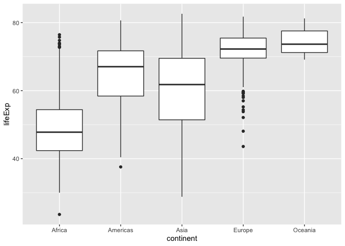
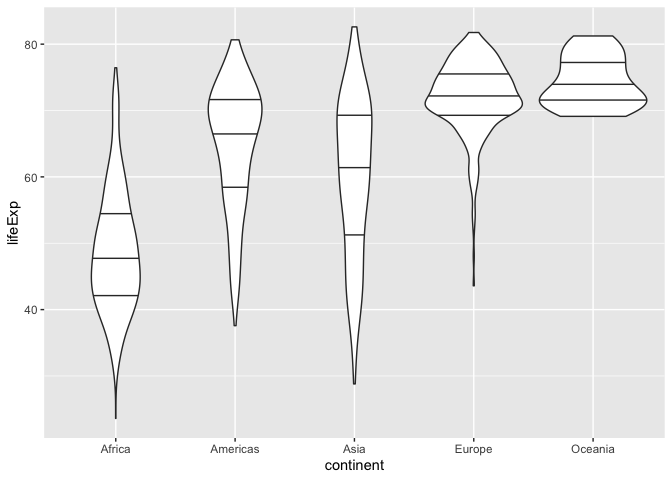
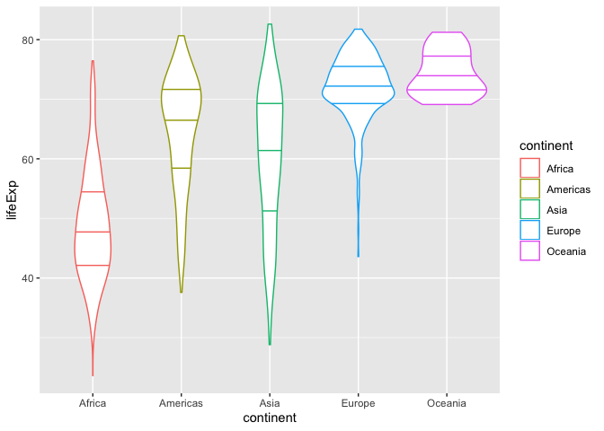
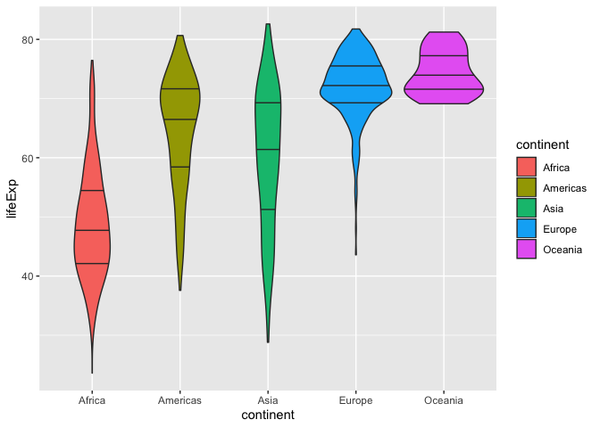
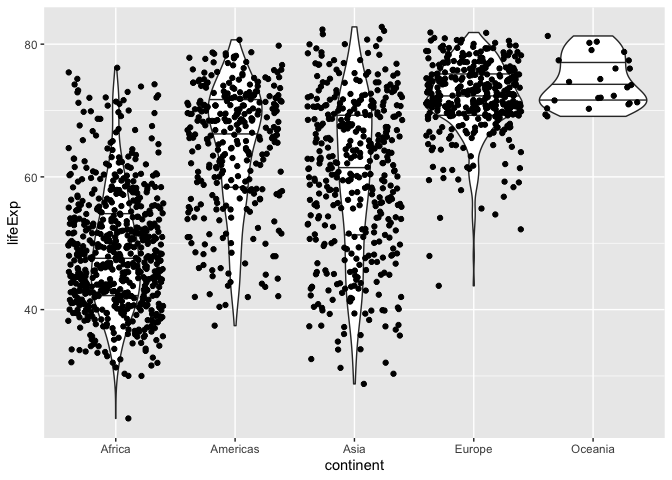
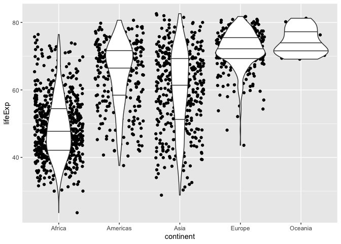
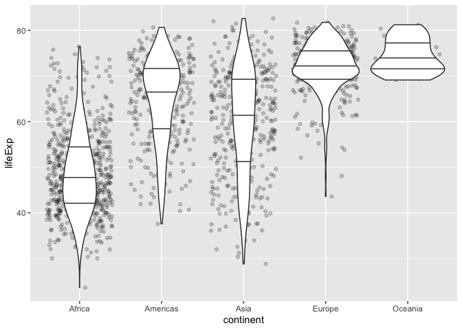
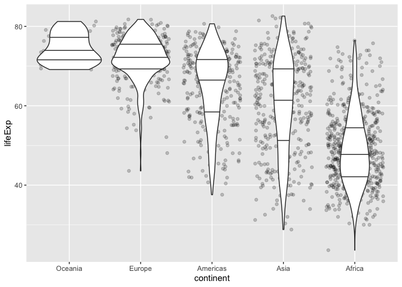

## load libraries


```r
#install.packages("tidyverse")
library(tidyverse)
```

```
## ── Attaching packages ───────────────────────────────────────── tidyverse 1.2.1 ──
```

```
## ✔ ggplot2 3.2.1     ✔ purrr   0.3.2
## ✔ tibble  2.1.3     ✔ dplyr   0.8.3
## ✔ tidyr   0.8.3     ✔ stringr 1.4.0
## ✔ readr   1.3.1     ✔ forcats 0.4.0
```

```
## ── Conflicts ──────────────────────────────────────────── tidyverse_conflicts() ──
## ✖ dplyr::filter() masks stats::filter()
## ✖ dplyr::lag()    masks stats::lag()
```

```r
library(gapminder)
```

## check data


```r
head(gapminder)
```

```
## # A tibble: 6 x 6
##   country     continent  year lifeExp      pop gdpPercap
##   <fct>       <fct>     <int>   <dbl>    <int>     <dbl>
## 1 Afghanistan Asia       1952    28.8  8425333      779.
## 2 Afghanistan Asia       1957    30.3  9240934      821.
## 3 Afghanistan Asia       1962    32.0 10267083      853.
## 4 Afghanistan Asia       1967    34.0 11537966      836.
## 5 Afghanistan Asia       1972    36.1 13079460      740.
## 6 Afghanistan Asia       1977    38.4 14880372      786.
```

## make boxplot


```r
#boxplot
ggplot(gapminder, aes(continent, lifeExp)) +
    geom_boxplot()
```

<!-- -->

## make violin plot


```r
#violin
ggplot(gapminder, aes(continent, lifeExp)) +
    geom_violin(draw_quantiles = c(.25, .5, .75)) 
```

<!-- -->

```r
#color
ggplot(gapminder, aes(continent, lifeExp, color = continent)) +
    geom_violin(draw_quantiles = c(.25, .5, .75)) 
```

<!-- -->

```r
#fill color
ggplot(gapminder, aes(continent, lifeExp, fill = continent)) +
    geom_violin(draw_quantiles = c(.25, .5, .75)) 
```

<!-- -->

# make violin with jitter


```r
#jitter
ggplot(gapminder, aes(continent, lifeExp)) +
    geom_violin(draw_quantiles = c(.25, .5, .75)) +
    geom_jitter()
```

<!-- -->

```r
#jitter
ggplot(gapminder, aes(continent, lifeExp)) +
    geom_jitter() +
    geom_violin(draw_quantiles = c(.25, .5, .75)) 
```

<!-- -->

```r
#jitter
ggplot(gapminder, aes(continent, lifeExp)) +
    geom_jitter(alpha = .2) +
    geom_violin(draw_quantiles = c(.25, .5, .75)) 
```

<!-- -->

## change order of axis labels


```r
#
gapminder$continent = factor(gapminder$continent, levels = c("Oceania", "Europe", "Americas", "Asia", "Africa"))

#jitter
ggplot(gapminder, aes(continent, lifeExp)) +
    geom_jitter(alpha = .2) +
    geom_violin(draw_quantiles = c(.25, .5, .75)) 
```

<!-- -->

> [check documentation of forcats()](https://forcats.tidyverse.org/)


