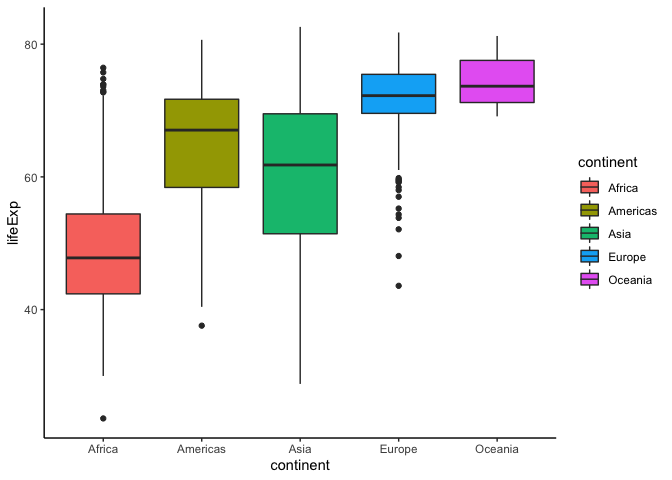

## load libraries


```r
library(tidyverse)
```

```
## ── Attaching packages ───────────────────────────────────────── tidyverse 1.2.1 ──
```

```
## ✔ ggplot2 3.2.1     ✔ purrr   0.3.2
## ✔ tibble  2.1.3     ✔ dplyr   0.8.3
## ✔ tidyr   0.8.3     ✔ stringr 1.4.0
## ✔ readr   1.3.1     ✔ forcats 0.4.0
```

```
## ── Conflicts ──────────────────────────────────────────── tidyverse_conflicts() ──
## ✖ dplyr::filter() masks stats::filter()
## ✖ dplyr::lag()    masks stats::lag()
```

```r
library(gapminder)
```

## check data


```r
head(gapminder)
```

```
## # A tibble: 6 x 6
##   country     continent  year lifeExp      pop gdpPercap
##   <fct>       <fct>     <int>   <dbl>    <int>     <dbl>
## 1 Afghanistan Asia       1952    28.8  8425333      779.
## 2 Afghanistan Asia       1957    30.3  9240934      821.
## 3 Afghanistan Asia       1962    32.0 10267083      853.
## 4 Afghanistan Asia       1967    34.0 11537966      836.
## 5 Afghanistan Asia       1972    36.1 13079460      740.
## 6 Afghanistan Asia       1977    38.4 14880372      786.
```

## make facet


```r
#facet
ggplot(gapminder, aes(lifeExp, gdpPercap)) +
    geom_point() + 
    facet_grid(continent~.)
```

<!-- -->

> Check facet_wrap() function


## coordinate flip


```r
ggplot(gapminder, aes(continent, lifeExp)) +
    geom_boxplot() +
    coord_flip()
```

<!-- -->

# change theme


```r
#theme
ggplot(gapminder, aes(continent, lifeExp, fill = continent)) +
    geom_boxplot() +
    theme_bw()
```

<!-- -->

```r
ggplot(gapminder, aes(continent, lifeExp, fill = continent)) +
    geom_boxplot() +
    theme_classic()
```

<!-- -->

```r
ggplot(gapminder, aes(continent, lifeExp, fill = continent)) +
    geom_boxplot() +
    theme_dark()
```

<!-- -->

```r
ggplot(gapminder, aes(continent, lifeExp, fill = continent)) +
    geom_boxplot() +
    theme_light()
```

<!-- -->

```r
#example of changing axis parameters
ggplot(gapminder, aes(continent, lifeExp, fill = continent)) +
    geom_boxplot() +
    theme(panel.background = element_rect(fill = "white"),
        panel.border = element_rect(fill = NA, colour = "black", size = 1),
        strip.text = element_text(face = "bold", size = 15),
        strip.background =element_rect(fill="white"),
        text = element_text(size=15, face = "bold"),
        axis.text.x = element_text(color = "black", angle = 90, hjust = 1),
        axis.text.y = element_text(color = "black"))
```

<!-- -->

```r
# remove legends using legend.position="none"
ggplot(gapminder, aes(continent, lifeExp, fill = continent)) +
    geom_boxplot() +
    theme(panel.background = element_rect(fill = "white"),
        panel.border = element_rect(fill = NA, colour = "black", size = 1),
        strip.text = element_text(face = "bold", size = 15),
        strip.background =element_rect(fill="white"),
        text = element_text(size=15, face = "bold"),
        axis.text.x = element_text(color = "black", angle = 90, hjust = 1),
        axis.text.y = element_text(color = "black"),
        legend.position="none")
```

<!-- -->

