## load libraries


```r
#install.packages("gapminder")
#install.packages("tidyverse")
library(tidyverse)
```

```
## ── Attaching packages ──────────────────────── tidyverse 1.2.1 ──
```

```
## ✔ ggplot2 3.2.1     ✔ purrr   0.3.2
## ✔ tibble  2.1.3     ✔ dplyr   0.8.3
## ✔ tidyr   0.8.3     ✔ stringr 1.4.0
## ✔ readr   1.3.1     ✔ forcats 0.4.0
```

```
## ── Conflicts ─────────────────────────── tidyverse_conflicts() ──
## ✖ dplyr::filter() masks stats::filter()
## ✖ dplyr::lag()    masks stats::lag()
```

```r
library(gapminder)
```

## check data


```r
head(gapminder)
```

```
## # A tibble: 6 x 6
##   country     continent  year lifeExp      pop gdpPercap
##   <fct>       <fct>     <int>   <dbl>    <int>     <dbl>
## 1 Afghanistan Asia       1952    28.8  8425333      779.
## 2 Afghanistan Asia       1957    30.3  9240934      821.
## 3 Afghanistan Asia       1962    32.0 10267083      853.
## 4 Afghanistan Asia       1967    34.0 11537966      836.
## 5 Afghanistan Asia       1972    36.1 13079460      740.
## 6 Afghanistan Asia       1977    38.4 14880372      786.
```

## make scatter plot 


```r
ggplot(gapminder, aes(gdpPercap, lifeExp)) +
  geom_point()
```

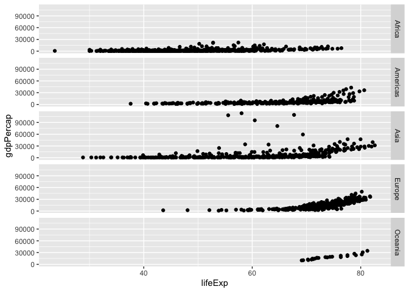<!-- -->

## log transformation of values


```r
#
ggplot(gapminder, aes(gdpPercap, lifeExp)) +
  geom_point() +
  scale_x_log10()
```

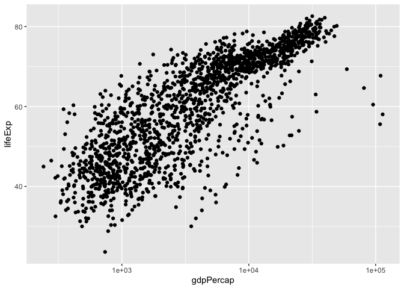<!-- -->

```r
# try another way
ggplot(gapminder, aes(log10(gdpPercap), lifeExp)) +
  geom_point()
```

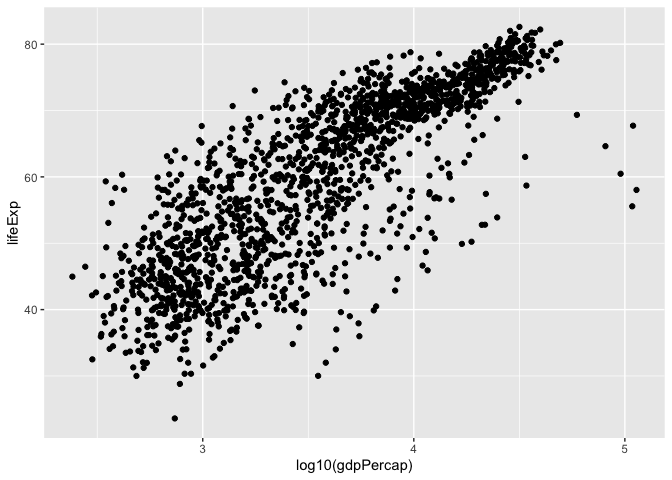<!-- -->

# change color


```r
ggplot(gapminder, aes(log10(gdpPercap), lifeExp)) +
  geom_point(aes(color=continent))
```

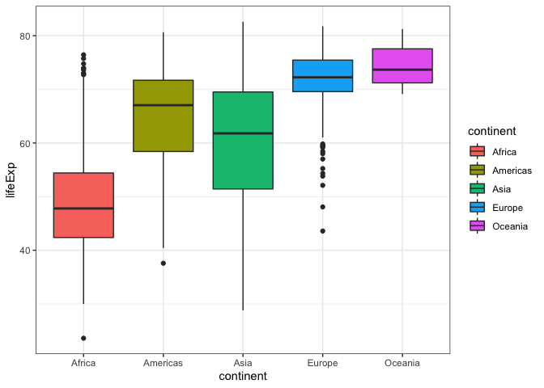<!-- -->

```r
#change sige of points
ggplot(gapminder, aes(log10(gdpPercap), lifeExp)) +
  geom_point(aes(color=continent), size = 3)
```

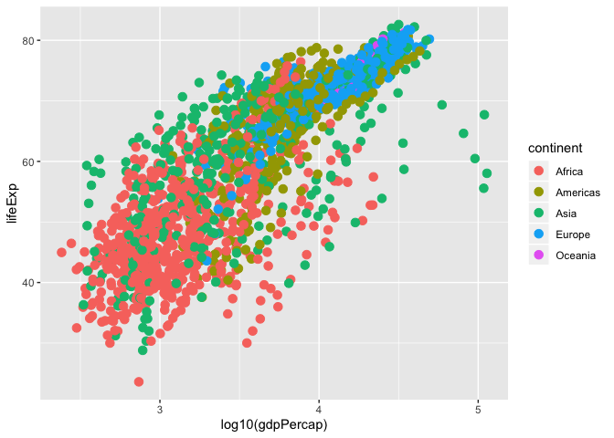<!-- -->

# change some other parameters


```r
ggplot(gapminder, aes(log10(gdpPercap), lifeExp)) +
  geom_point(pch=17, size=2, alpha= .8, aes(color=continent)) 
```

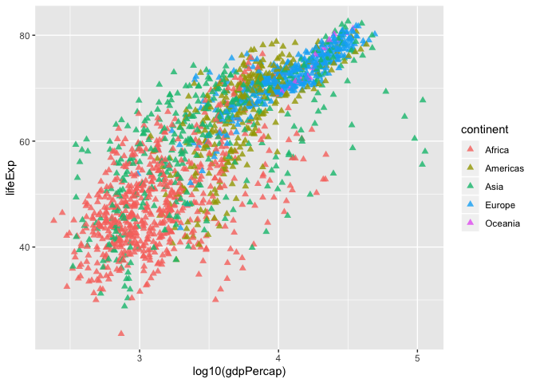<!-- -->

```r
# what about this
ggplot(gapminder, aes(log10(gdpPercap), lifeExp)) +
  geom_point(pch=17, size=2, alpha= .8, color= "red")
```

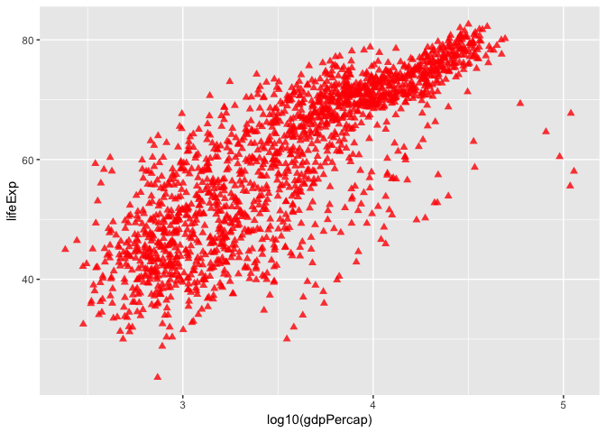<!-- -->

## use smoothing function


```r
ggplot(gapminder, aes(log10(gdpPercap), lifeExp)) +
  geom_point() +
  geom_smooth()
```

```
## `geom_smooth()` using method = 'gam' and formula 'y ~ s(x, bs = "cs")'
```

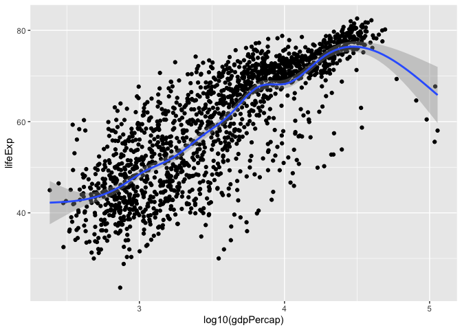<!-- -->

```r
# specify the method for smoothing
ggplot(gapminder, aes(log10(gdpPercap), lifeExp)) +
  geom_point() +
  geom_smooth(lwd=2, se=FALSE, method="lm", col="blue")
```

<!-- -->

```r
# smooth by continent
ggplot(gapminder, aes(log10(gdpPercap), lifeExp)) +
  geom_point() +
  geom_smooth(aes(color = continent))
```

```
## `geom_smooth()` using method = 'loess' and formula 'y ~ x'
```

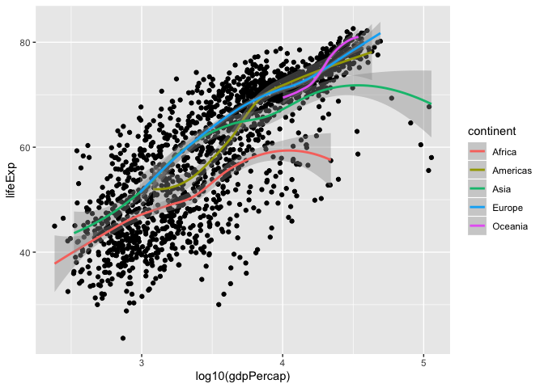<!-- -->

```r
# smooth by continent
ggplot(gapminder, aes(log10(gdpPercap), lifeExp)) +
  geom_point(aes(color = continent)) +
  geom_smooth(aes(color = continent))
```

```
## `geom_smooth()` using method = 'loess' and formula 'y ~ x'
```

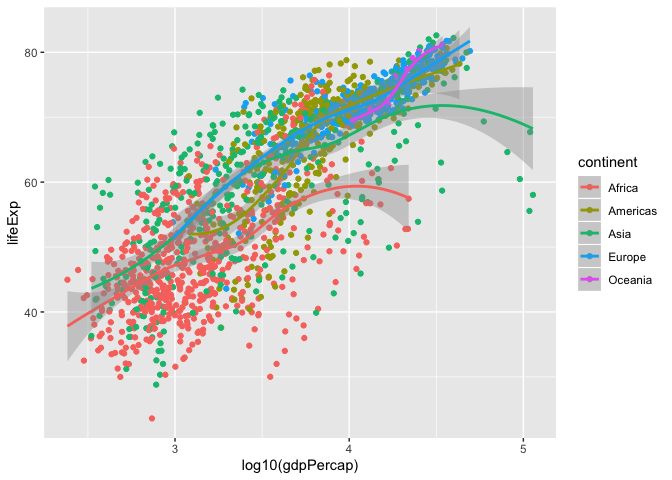<!-- -->

## example on faceting


```r
ggplot(gapminder, aes(log10(gdpPercap), lifeExp)) +
  geom_point() +
  facet_wrap(~continent)
```

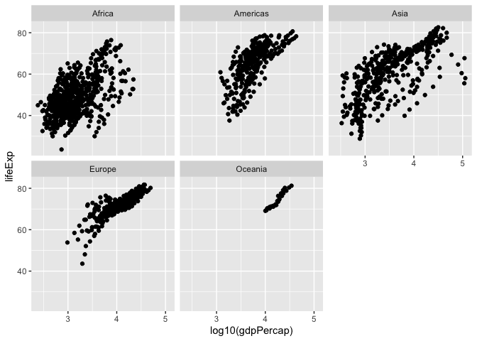<!-- -->

```r
# change faceting  by column
ggplot(gapminder, aes(log10(gdpPercap), lifeExp)) +
  geom_point() +
  facet_wrap(~continent, ncol=1)
```

<!-- -->

```r
# change faceting by row
ggplot(gapminder, aes(log10(gdpPercap), lifeExp)) +
  geom_point() +
  facet_wrap(~continent, nrow =1)
```

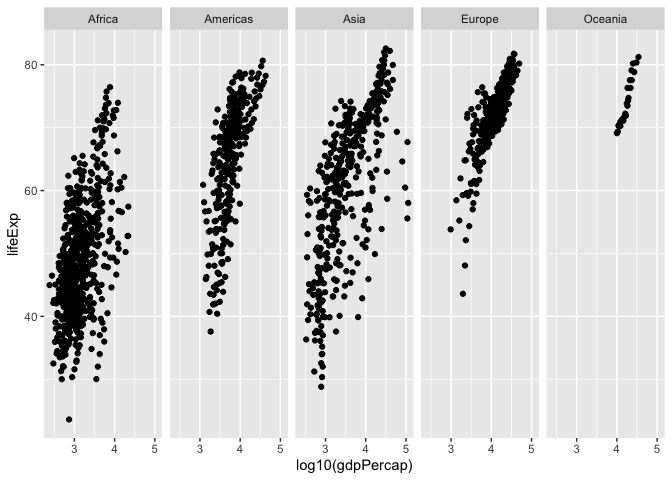<!-- -->


## voilin, boxplot and jitter


```r
#boxplot
ggplot(gapminder, aes(continent, lifeExp)) +
  geom_jitter() +
  geom_boxplot()
```

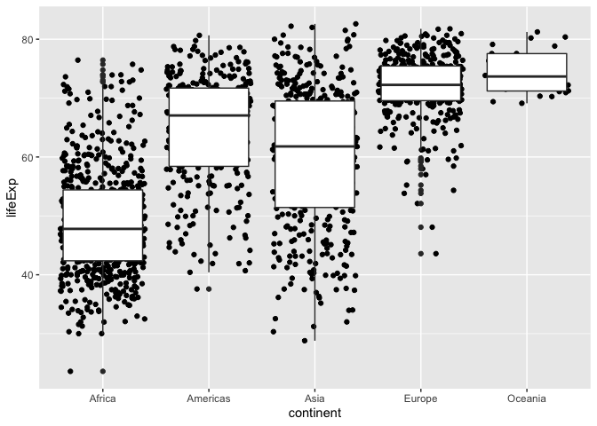<!-- -->

```r
#color
ggplot(gapminder, aes(continent, lifeExp), fill = continent) +
  geom_jitter(alpha=1/2) +
  geom_boxplot()
```

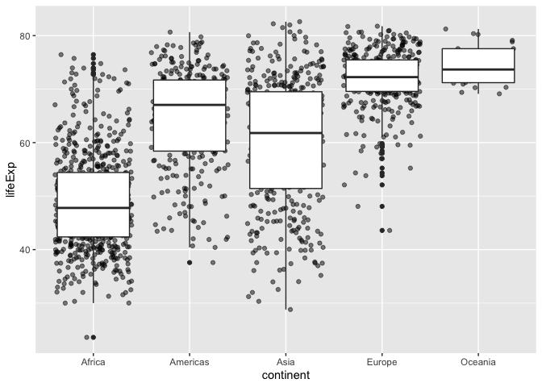<!-- -->

```r
#violin
ggplot(gapminder, aes(continent, lifeExp)) +
  geom_jitter() +
  geom_violin()
```

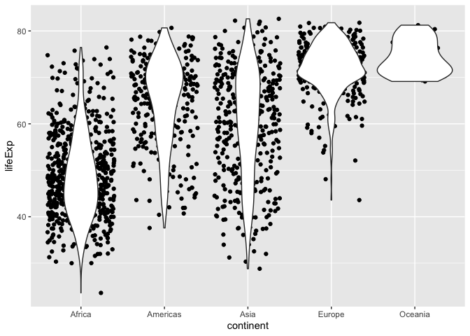<!-- -->

```r
#color
ggplot(gapminder, aes(continent, lifeExp), fill = continent) +
  geom_jitter(alpha=1/2) +
  geom_violin()
```

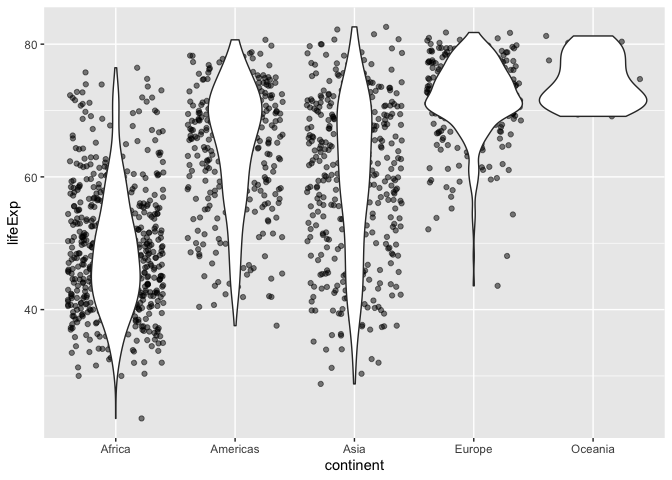<!-- -->

## histograms


```r
ggplot(gapminder, aes(lifeExp)) +
  geom_histogram()
```

```
## `stat_bin()` using `bins = 30`. Pick better value with `binwidth`.
```

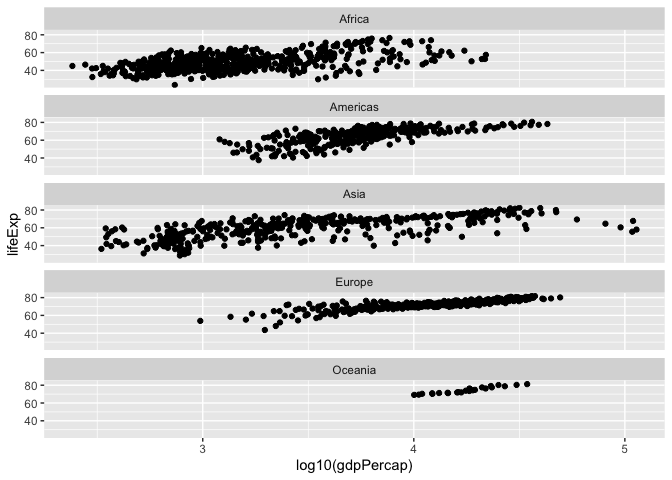<!-- -->

```r
# change binsize
ggplot(gapminder, aes(lifeExp)) +
  geom_histogram(bins=50)
```

<!-- -->

```r
#
ggplot(gapminder, aes(lifeExp)) +
  geom_histogram(bins=100)
```

<!-- -->

```r
#
ggplot(gapminder, aes(lifeExp)) +
  geom_histogram(bins=500) 
```

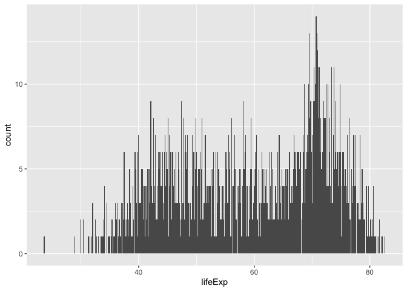<!-- -->

```r
# color by continent
ggplot(gapminder, aes(lifeExp)) + 
  geom_histogram(aes(color=continent))
```

```
## `stat_bin()` using `bins = 30`. Pick better value with `binwidth`.
```

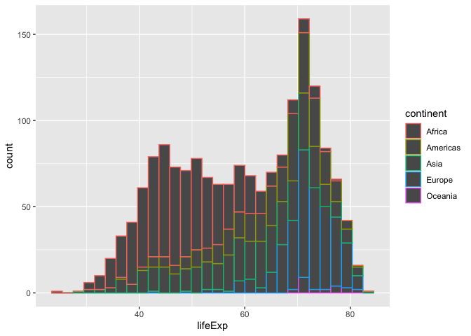<!-- -->

## density plot


```r
ggplot(gapminder, aes(lifeExp)) + 
  geom_density()
```

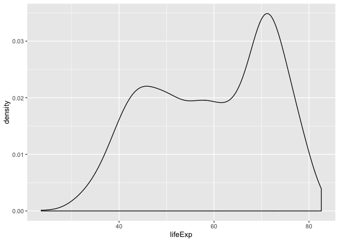<!-- -->

```r
# color
ggplot(gapminder, aes(lifeExp)) + 
  geom_density(aes(fill= "red"))
```

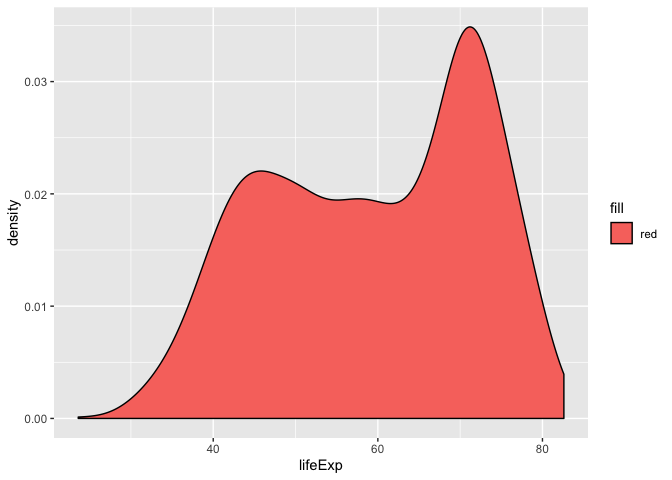<!-- -->

```r
# change alpha
ggplot(gapminder, aes(lifeExp)) + 
  geom_density(aes(fill= "red"), alpha=1/4)
```

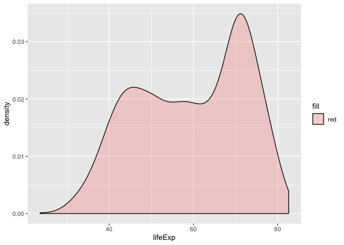<!-- -->

```r
#
ggplot(gapminder, aes(lifeExp)) + 
  geom_density(aes(fill=continent), alpha=1/4)
```

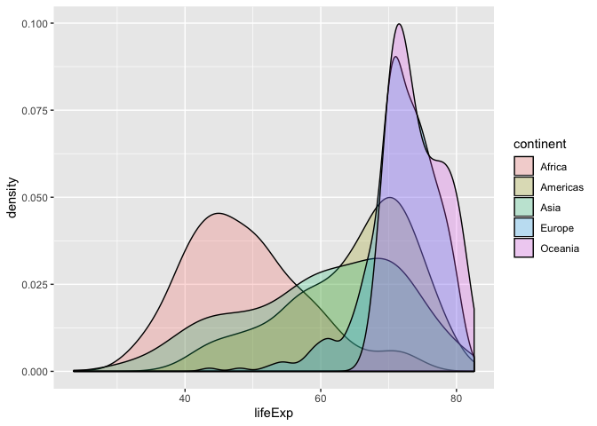<!-- -->


